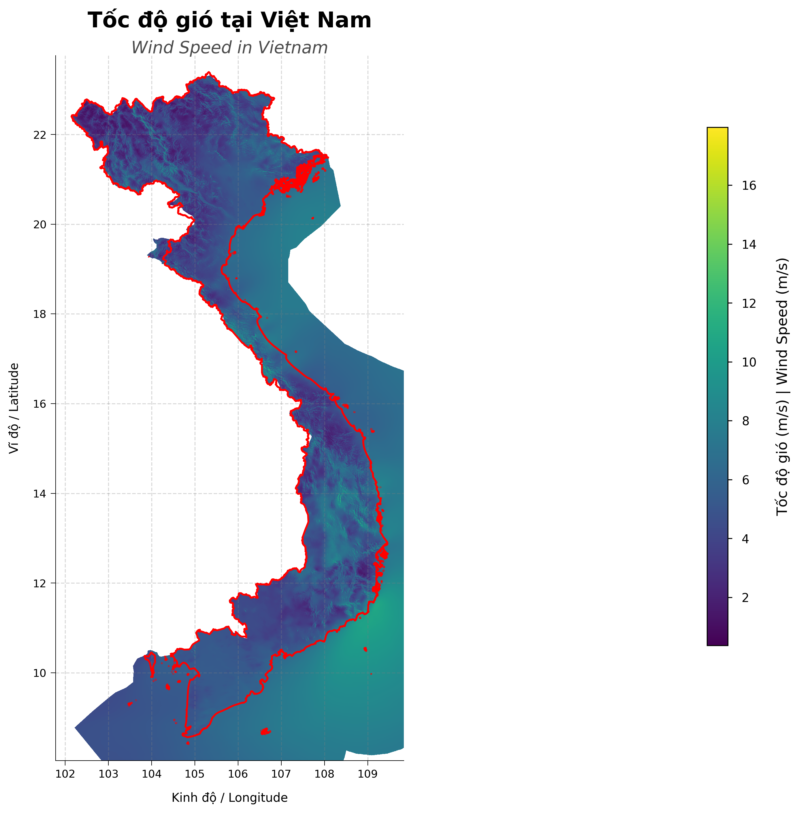
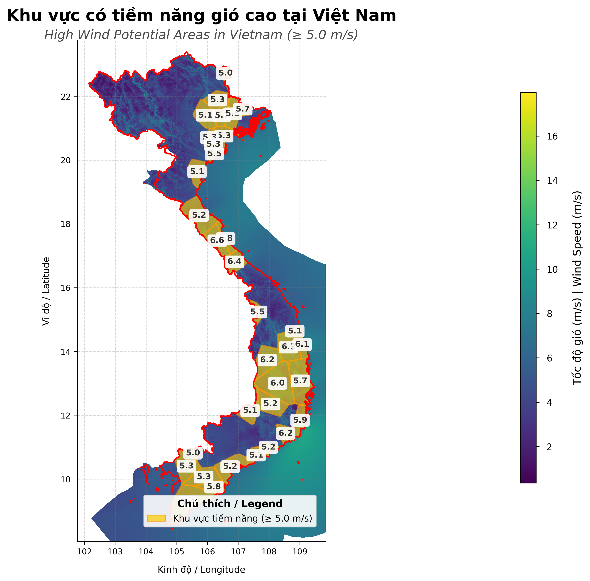
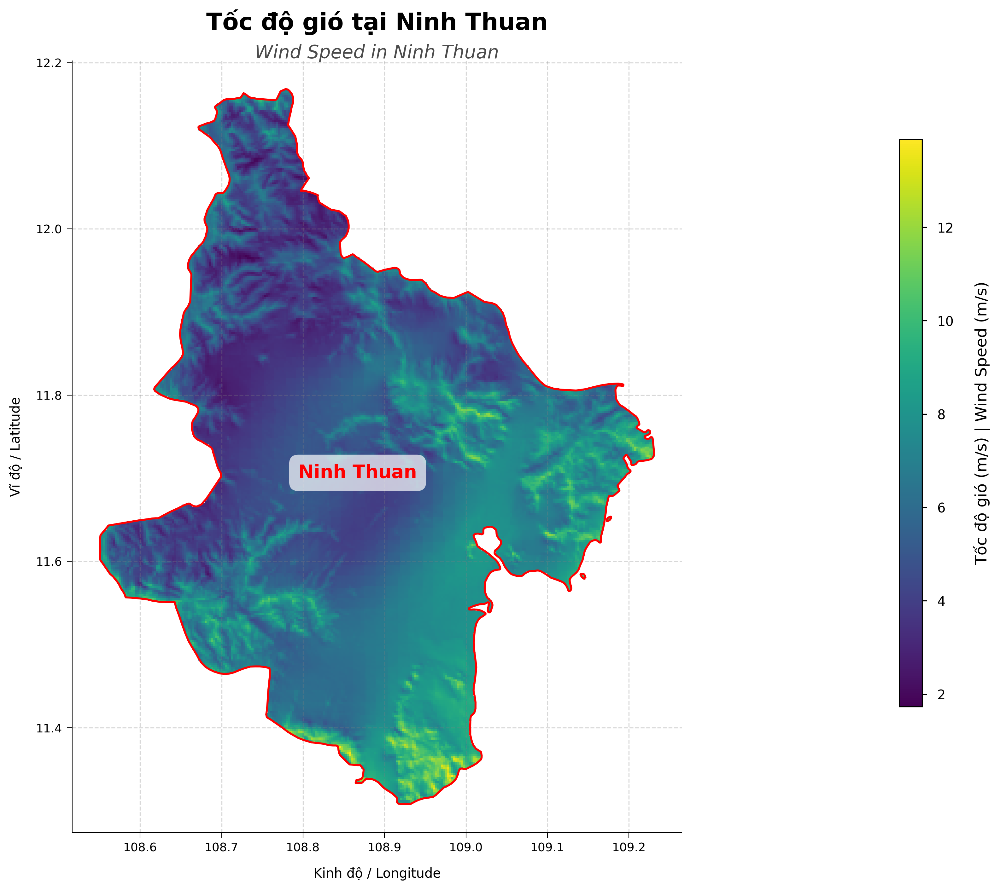
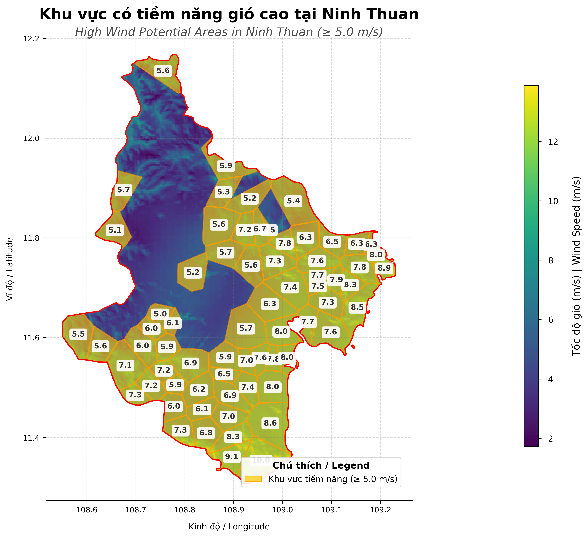
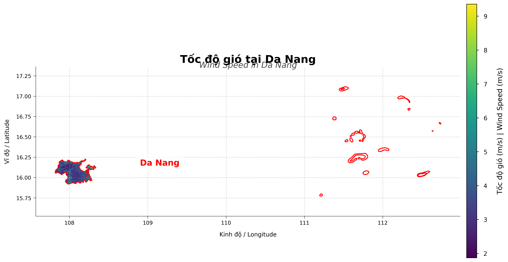
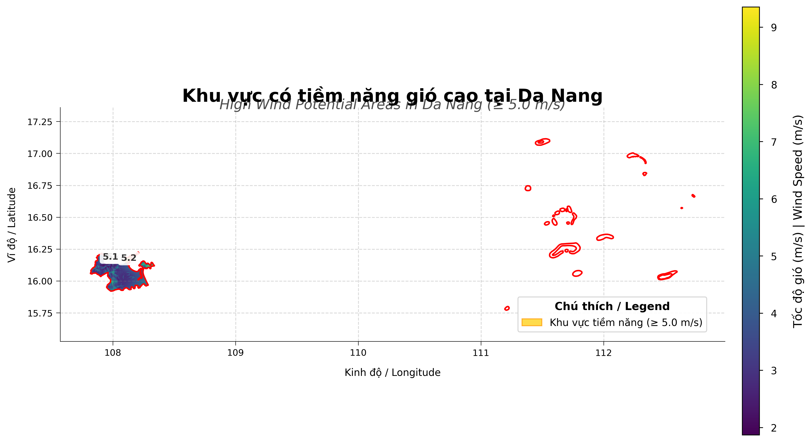
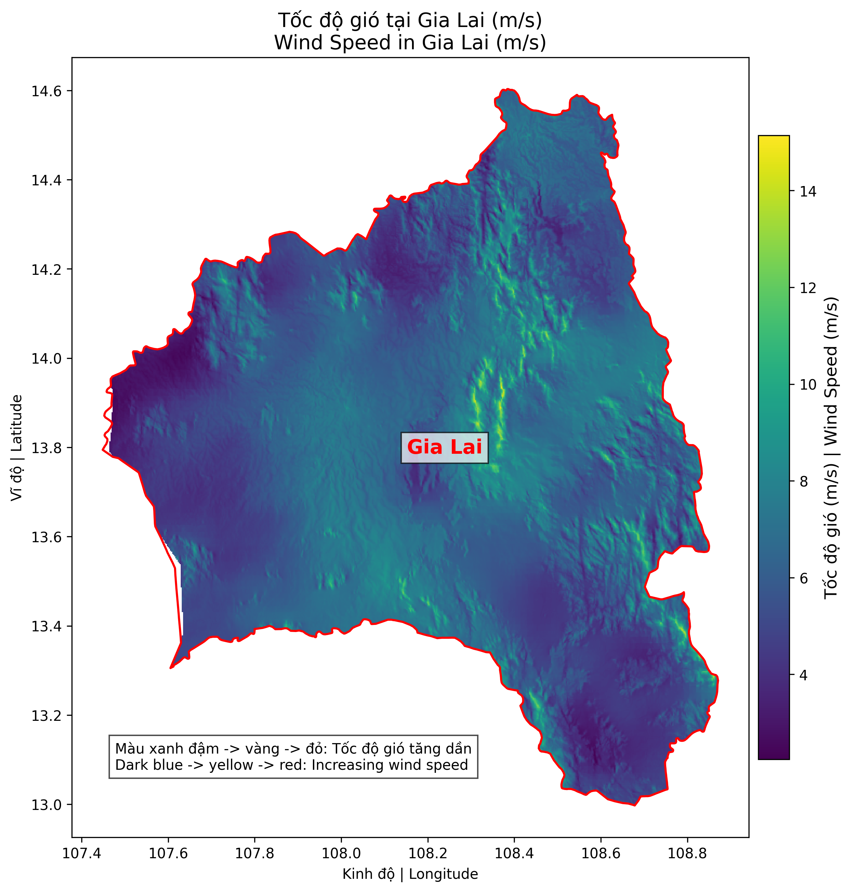
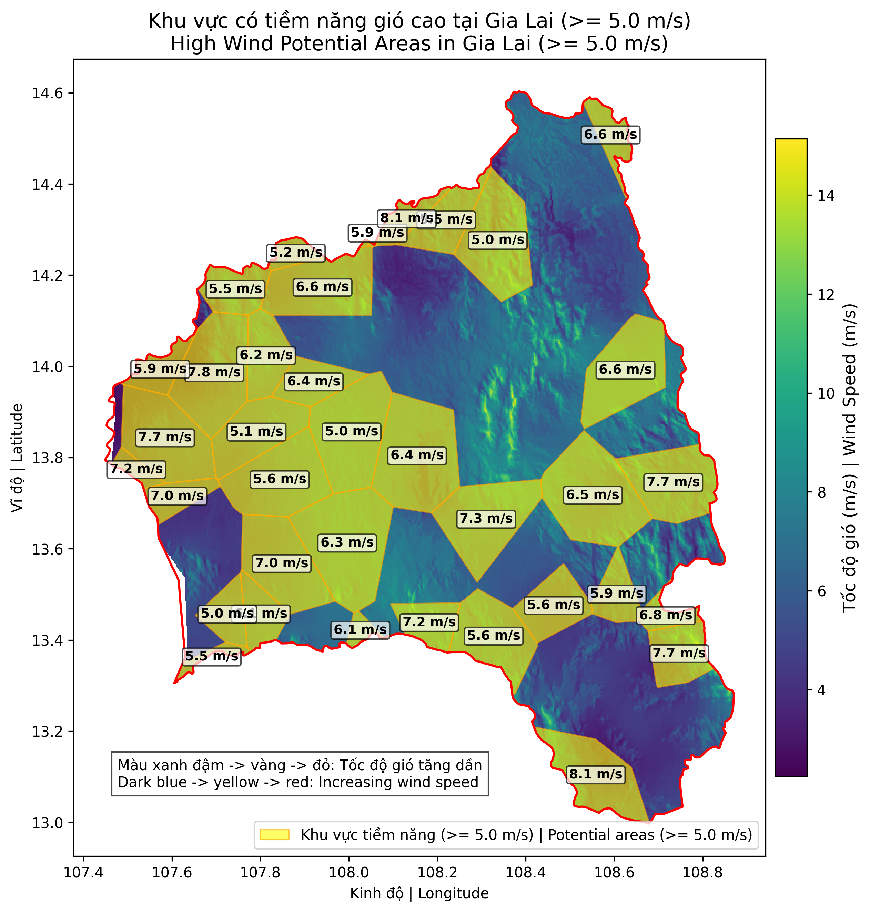
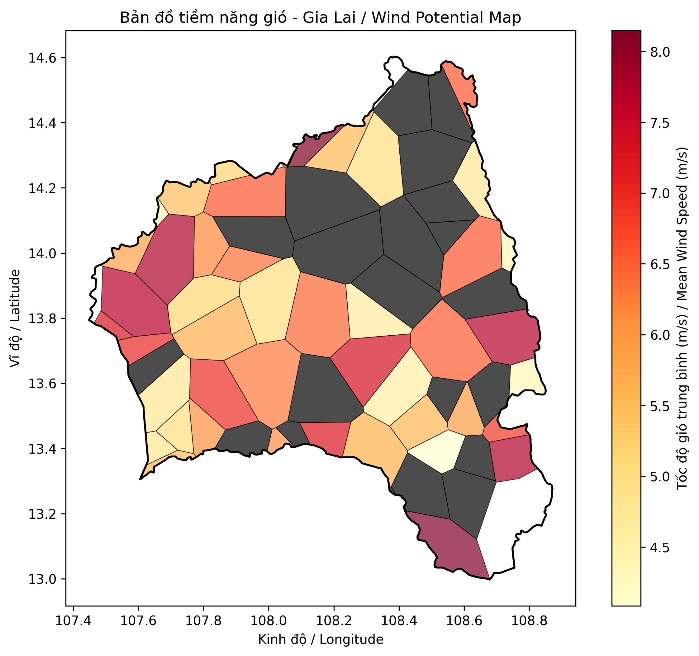
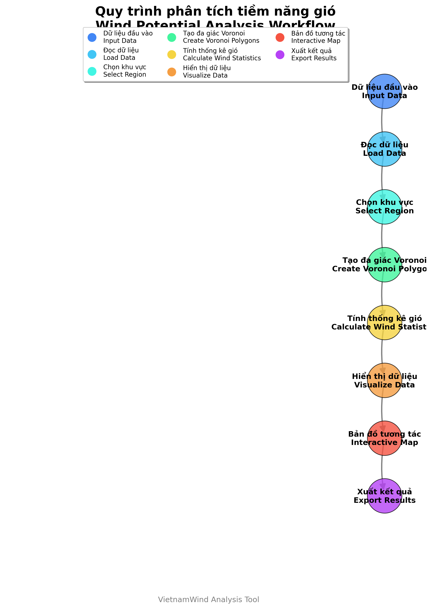

# VietnamWind | 🇻🇳 Phân tích tiềm năng gió tại Việt Nam | Wind Potential Analysis in Vietnam

<p align="center">
  
</p>

*Công cụ phân tích tiềm năng gió tại Việt Nam dựa trên dữ liệu từ [Global Wind Atlas](https://globalwindatlas.info/area/Vietnam).*

*Wind potential analysis tool for Vietnam based on data from [Global Wind Atlas](https://globalwindatlas.info/area/Vietnam).*

## 📊 Kết quả | Results

### Phân tích toàn quốc | Nationwide Analysis

<p align="center">
  
  
</p>

*Bản đồ tốc độ gió toàn quốc (trái) và Khu vực tiềm năng cao trên toàn quốc (phải)*

*Nationwide wind speed map (left) and High potential areas (right)*

*File tương tác | Interactive files: `vietnam_wind_folium.html`, `vietnam_wind_interactive.html`*

### Phân tích cấp tỉnh | Provincial Analysis 

#### Ninh Thuận - Tỉnh có tiềm năng gió cao nhất | Ninh Thuan - Province with Highest Wind Potential

<p align="center">
  
  
</p>

*Bản đồ tương tác tỉnh Ninh Thuận - một trong những khu vực có tiềm năng gió tốt nhất Việt Nam*

*Interactive map of Ninh Thuan province - one of the areas with the best wind potential in Vietnam*

*File tương tác | Interactive files: `vietnam_wind_folium_ninh_thuan.html`, `vietnam_wind_interactive_ninh_thuan.html`*

#### Đà Nẵng - Phân tích chi tiết | Da Nang - Detailed Analysis

<p align="center">
  
  
</p>

*Bản đồ tương tác Đà Nẵng - Nhấp để xem bản đồ tương tác đầy đủ*

*Da Nang interactive map - Click to view full interactive map*

*File tương tác | Interactive files: `vietnam_wind_folium_da_nang.html`*

#### Gia Lai - Khu vực có tiềm năng cao ở Tây Nguyên | Gia Lai - High Potential Area in Central Highlands

<p align="center">
  
  
</p>

*Bản đồ tốc độ gió tỉnh Gia Lai (trái) và Khu vực tiềm năng cao tại Gia Lai (phải)*

*Gia Lai province wind speed map (left) and High potential areas (right)*

*File tương tác | Interactive files: `vietnam_wind_folium_gia_lai.html`, `vietnam_wind_interactive_gia_lai.html`*

### ✨ Bản đồ tương tác | Interactive Map

<p align="center">
  
</p>

*Bản đồ tương tác với tính năng hover để xem thông tin tốc độ gió*

*Interactive map with hover feature to view wind speed information*

*File tương tác | Interactive files: `vietnam_wind_folium.html`*

<p align="center">
  
</p>

*Bản đồ tương tác tỉnh Gia Lai với thông tin chi tiết về tốc độ gió*

*Interactive map of Gia Lai province with detailed wind speed information*

*File tương tác | Interactive files: `vietnam_wind_interactive_gia_lai.html`*

> 📌 **Lưu ý**: Đây chỉ là hình ảnh tĩnh. Để trải nghiệm tương tác đầy đủ, hãy mở các file HTML được chú thích bên cạnh mỗi hình ảnh.
>
> **Note**: These are just static images. For full interactive experience, open the HTML files noted beside each image.

#### 🔍 Tạo bản đồ tương tác cho bất kỳ tỉnh nào | Create interactive map for any province

Dự án này cung cấp hai loại bản đồ tương tác:

This project provides two types of interactive maps:

1. **Bản đồ tương tác HTML (mpld3)** - Cho phép hover chuột để xem thông tin chi tiết
   
   **Interactive HTML Map (mpld3)** - Allows mouse hover to view detailed information

2. **Bản đồ tương tác Web (folium)** - Bản đồ trực quan dựa trên Leaflet.js, có thể zoom, pan và hiển thị tooltip
   
   **Interactive Web Map (folium)** - Visual map based on Leaflet.js, with zoom, pan and tooltip display capabilities

##### Tạo bản đồ tương tác HTML | Create HTML interactive map
```bash
# Tạo bản đồ tương tác HTML cho tỉnh Gia Lai
# Create HTML interactive map for Gia Lai province
python interactive_map.py --region "Gia Lai"

# Tạo bản đồ tương tác HTML cho tỉnh Đà Nẵng với 200 điểm Voronoi để phân tích chi tiết hơn
# Create HTML interactive map for Da Nang with 200 Voronoi points for more detailed analysis
python interactive_map.py --region "Da Nang" --points 200

# Tạo bản đồ tương tác HTML cho tỉnh Ninh Thuận - khu vực có tiềm năng gió cao
# Create HTML interactive map for Ninh Thuan - an area with high wind potential
python interactive_map.py --region "Ninh Thuan" 

# Tạo bản đồ tương tác HTML cho toàn bộ Việt Nam
# Create HTML interactive map for the entire Vietnam
python interactive_map.py
```

##### Sử dụng demo.py để tạo bất kỳ loại bản đồ nào | Use demo.py to create any type of map
```bash
# Chạy trong chế độ tương tác và chọn tùy chọn 4
# Run in interactive mode and select option 4
python demo.py

# Phân tích một tỉnh cụ thể (chọn tùy chọn 2)
# Analyze a specific province (select option 2)
python demo.py --option 2
```

<p align="center">
  
</p>

*Bản đồ tương tác folium với nhiều tính năng phân tích không gian*

*Folium interactive map with various spatial analysis features*

*File tương tác | Interactive files: `vietnam_wind_folium.html`*

Bản đồ tương tác cho phép:
Interactive map allows:

- Di chuột qua từng ô Voronoi để xem thông tin chi tiết về tốc độ gió
  
  Hover over each Voronoi cell to view detailed wind speed information

- Phân tích tập trung vào bất kỳ tỉnh thành nào tại Việt Nam
  
  Focused analysis on any province in Vietnam

- Dễ dàng so sánh tiềm năng gió giữa các khu vực khác nhau
  
  Easy comparison of wind potential between different regions

- Zoom in/out và di chuyển bản đồ (folium)
  
  Zoom in/out and pan the map (folium)

- Hiển thị/ẩn các lớp khác nhau (folium)
  
  Show/hide different layers (folium)

- Chọn giữa nhiều lớp bản đồ nền khác nhau
  
  Choose between multiple basemap layers

- Đo đạc khoảng cách và diện tích
  
  Measure distances and areas

- Tìm kiếm vị trí trên bản đồ
  
  Search for locations on the map

#### Các tùy chọn khác | Other options
```bash
# Liệt kê các tỉnh/thành phố có sẵn
# List available provinces/cities
python interactive_map.py --list-regions

# Chạy trong chế độ tương tác (CLI menu)
# Run in interactive mode (CLI menu)
python interactive_map.py
```

## 🚀 Tính năng chính | Key Features

- 📊 Đọc và hiển thị dữ liệu tốc độ gió tại Việt Nam
  
  Read and display wind speed data in Vietnam

- 🔷 Tạo các đa giác Voronoi để phân tích chi tiết
  
  Create Voronoi polygons for detailed analysis

- 📈 Tính toán thống kê gió cho từng khu vực
  
  Calculate wind statistics for each area

- 🌟 Xác định các khu vực có tiềm năng gió cao
  
  Identify areas with high wind potential

- 🗺️ Xuất kết quả dưới dạng file KML (có thể xem trên Google Earth) và CSV
  
  Export results as KML files (viewable in Google Earth) and CSV

- 📉 Tạo biểu đồ trực quan hóa dữ liệu
  
  Generate data visualization charts

- 🖱️ Bản đồ tương tác cho phép hover chuột để xem thông tin tốc độ gió
  
  Interactive map with mouse hover to view wind speed information

- 🌐 Bản đồ web tương tác với các công cụ phân tích tiên tiến
  
  Interactive web map with advanced analysis tools

## 💻 Cài đặt | Installation

### Tạo môi trường ảo | Create virtual environment

#### Sử dụng venv (Python 3.6+) | Using venv (Python 3.6+)

```bash
# Tạo môi trường ảo
# Create virtual environment
python -m venv venv

# Kích hoạt môi trường ảo
# Activate virtual environment
# Windows
venv\Scripts\activate
# Linux/Mac
source venv/bin/activate
```

#### Sử dụng Conda | Using Conda

```bash
# Tạo môi trường ảo
# Create conda environment
conda create --name vietnamwind python=3.8

# Kích hoạt môi trường
# Activate environment
conda activate vietnamwind
```

### Cài đặt thư viện | Install libraries

```bash
# Cài đặt thư viện cần thiết
# Install required libraries
pip install -r requirements.txt
```

## 🔧 Sử dụng | Usage

```bash
# Chạy demo
# Run demo
python demo.py

# Hoặc chạy từ dòng lệnh
# Or run from command line
python vietnamwind.py --boundary data/vietnam.geojson --wind data/VNM_wind-speed_100m.tif
```

### 📱 Tính năng tương tác mới | New Interactive Features

Sử dụng tùy chọn 4 trong menu demo để tạo bản đồ tương tác:

Use option 4 in the demo menu to create an interactive map:

```
===== Demo phân tích tiềm năng gió tại Việt Nam =====
===== Vietnam Wind Potential Analysis Demo =====

Tùy chọn demo / Demo options:
1. Phân tích toàn bộ Việt Nam / Analyze entire Vietnam
2. Phân tích một tỉnh/thành phố cụ thể / Analyze a specific province/city
3. Liệt kê các tỉnh/thành phố có sẵn / List available provinces/cities
4. Tạo bản đồ tương tác có thể hover chuột / Create interactive map with hover
0. Thoát / Exit
```

<p align="center">
  
</p>

*Quy trình phân tích tiềm năng gió*

*Wind potential analysis workflow*

## 🏭 Ứng dụng thực tế | Practical Applications

Dữ liệu phân tích từ công cụ này có thể được sử dụng để:

Analysis data from this tool can be used to:

- Xác định vị trí tiềm năng cho các dự án điện gió
  
  Identify potential locations for wind power projects

- Đánh giá khả thi về mặt kỹ thuật cho các dự án năng lượng tái tạo
  
  Assess technical feasibility for renewable energy projects

- Nghiên cứu phân bố tài nguyên gió trên toàn quốc
  
  Study wind resource distribution across the country

- Hỗ trợ lập kế hoạch phát triển năng lượng bền vững
  
  Support sustainable energy development planning

- So sánh hiệu quả đầu tư giữa các khu vực khác nhau
  
  Compare investment efficiency between different regions

- Tính toán tiềm năng sản xuất năng lượng theo vùng
  
  Calculate energy production potential by region

## 📖 Xem thêm thông tin chi tiết | See more details

Xem thêm thông tin chi tiết tại [vietnamwind/README.md](vietnamwind/README.md)

See more detailed information at [vietnamwind/README.md](vietnamwind/README.md)

## 📊 Thống kê tiềm năng gió | Wind Potential Statistics

Bảng dưới đây cung cấp một số thống kê về tốc độ gió tại một số tỉnh thành có tiềm năng cao:

The table below provides statistics on wind speed in some provinces with high potential:

| Tỉnh/Thành phố<br>Province/City | Tốc độ gió trung bình (m/s)<br>Average wind speed (m/s) | Khu vực tiềm năng cao (%)<br>High potential area (%) |
|----------------------------------|--------------------------------------------------------|------------------------------------------------------|
| Ninh Thuận<br>Ninh Thuan        | 7.2                                                    | 68%                                                  |
| Bình Thuận<br>Binh Thuan        | 6.8                                                    | 51%                                                  |
| Quảng Bình<br>Quang Binh        | 5.9                                                    | 32%                                                  |
| Gia Lai                          | 5.8                                                    | 28%                                                  |
| Đà Nẵng<br>Da Nang              | 5.5                                                    | 25%                                                  |
| Toàn quốc<br>Nationwide         | 5.3                                                    | 22%                                                  |

*Dữ liệu trên được tính toán cho độ cao 100m, dựa trên phân tích từ công cụ này*

*The above data is calculated for a height of 100m, based on analysis from this tool*

## 📝 Lưu ý về hình ảnh | Notes about images

Để hiển thị đầy đủ hình ảnh trong README, vui lòng đảm bảo tải các hình ảnh vào thư mục tương ứng:

To properly display images in this README, please ensure you upload images to the corresponding directories:

- Các hình ảnh chung | Common images: `assets/images/`
- Kết quả phân tích | Analysis results: `results/`
