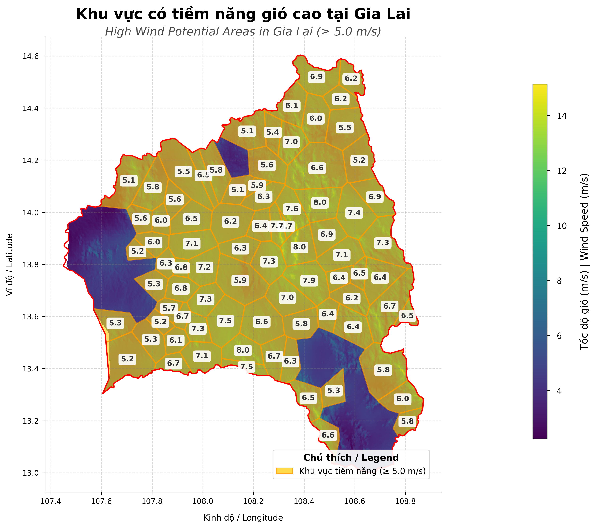

# VietnamWind | 🇻🇳 Phân tích tiềm năng gió tại Việt Nam

<p align="center">
  
</p>

*Công cụ phân tích tiềm năng gió tại Việt Nam dựa trên dữ liệu từ [Global Wind Atlas](https://globalwindatlas.info/area/Vietnam).*

*(Wind potential analysis tool for Vietnam based on data from [Global Wind Atlas](https://globalwindatlas.info/area/Vietnam).)*

## 📊 Kết quả | Results

<p align="center">
  
  
</p>

*Bản đồ tốc độ gió (trái) và Khu vực tiềm năng cao (phải) - Wind speed map (left) and High potential areas (right)*

### ✨ Bản đồ tương tác | Interactive Map

<p align="center">
  
</p>

*Bản đồ tương tác với tính năng hover để xem thông tin tốc độ gió - Interactive map with hover feature to view wind speed information*

> 📌 **Lưu ý / Note**: Đây chỉ là hình ảnh tĩnh. Để trải nghiệm tương tác đầy đủ, hãy tạo và mở file HTML được tạo ra bằng lệnh dưới đây.
>
> This is just a static image. For full interactive experience, create and open the HTML file generated using the commands below.

#### 🔍 Tạo bản đồ tương tác cho bất kỳ tỉnh nào | Create interactive map for any province

Dự án này cung cấp hai loại bản đồ tương tác:

1. **Bản đồ tương tác HTML (mpld3)** - Cho phép hover chuột để xem thông tin chi tiết
2. **Bản đồ tương tác Web (folium)** - Bản đồ trực quan dựa trên Leaflet.js, có thể zoom, pan và hiển thị tooltip

##### Tạo bản đồ tương tác HTML
```bash
# Tạo bản đồ tương tác HTML cho tỉnh Gia Lai
python interactive_map.py --region "Gia Lai"

# Tạo bản đồ tương tác HTML cho toàn bộ Việt Nam
python interactive_map.py
```

##### Tạo bản đồ tương tác Web (đề xuất)
```bash
# Tạo bản đồ tương tác Web cho tỉnh Gia Lai
python interactive_map.py --region "Gia Lai" --web

# Tạo bản đồ tương tác Web cho toàn bộ Việt Nam
python interactive_map.py --web
```

<p align="center">
  <a href="vietnam_wind_folium_gia_lai.html" target="_blank">
    
    <br>
    <em>Nhấp vào để xem bản đồ tương tác (Click to view interactive map)</em>
  </a>
</p>

Bản đồ tương tác cho phép:
- Di chuột qua từng ô Voronoi để xem thông tin chi tiết về tốc độ gió
- Phân tích tập trung vào bất kỳ tỉnh thành nào tại Việt Nam
- Dễ dàng so sánh tiềm năng gió giữa các khu vực khác nhau
- Zoom in/out và di chuyển bản đồ (folium)
- Hiển thị/ẩn các lớp khác nhau (folium)

#### Các tùy chọn khác | Other options
```bash
# Liệt kê các tỉnh/thành phố có sẵn
python interactive_map.py --list-regions

# Chạy trong chế độ tương tác (CLI menu)
python interactive_map.py
```

## 🚀 Tính năng chính | Key Features

- 📊 Đọc và hiển thị dữ liệu tốc độ gió tại Việt Nam
  - *(Read and display wind speed data in Vietnam)*
- 🔷 Tạo các đa giác Voronoi để phân tích chi tiết
  - *(Create Voronoi polygons for detailed analysis)*
- 📈 Tính toán thống kê gió cho từng khu vực
  - *(Calculate wind statistics for each area)*
- 🌟 Xác định các khu vực có tiềm năng gió cao
  - *(Identify areas with high wind potential)*
- 🗺️ Xuất kết quả dưới dạng file KML (có thể xem trên Google Earth) và CSV
  - *(Export results as KML files (viewable in Google Earth) and CSV)*
- 📉 Tạo biểu đồ trực quan hóa dữ liệu
  - *(Generate data visualization charts)*
- 🖱️ Bản đồ tương tác cho phép hover chuột để xem thông tin tốc độ gió
  - *(Interactive map with mouse hover to view wind speed information)*

## 💻 Cài đặt | Installation

### Tạo môi trường ảo | Create virtual environment

#### Sử dụng venv (Python 3.6+)

```bash
# Tạo môi trường ảo | Create virtual environment
python -m venv venv

# Kích hoạt môi trường ảo | Activate virtual environment
# Windows
venv\Scripts\activate
# Linux/Mac
source venv/bin/activate
```

#### Sử dụng Conda

```bash
# Tạo môi trường ảo | Create conda environment
conda create --name vietnamwind python=3.8

# Kích hoạt môi trường | Activate environment
conda activate vietnamwind
```

### Cài đặt thư viện | Install libraries

```bash
# Cài đặt thư viện cần thiết | Install required libraries
pip install -r vietnamwind/requirements.txt

# Cài đặt thư viện mpld3 cho tính năng tương tác
# Install mpld3 for interactive features
pip install mpld3
```

## 🔧 Sử dụng | Usage

```bash
# Chạy demo | Run demo
cd vietnamwind
python demo.py

# Hoặc chạy từ dòng lệnh | Or run from command line
python vietnamwind.py --boundary data/vietnam.geojson --wind data/VNM_wind-speed_100m.tif
```

### 📱 Tính năng tương tác mới | New Interactive Features

Sử dụng tùy chọn 4 trong menu demo để tạo bản đồ tương tác:

```
===== Demo phân tích tiềm năng gió tại Việt Nam =====
===== Vietnam Wind Potential Analysis Demo =====

Tùy chọn demo / Demo options:
1. Phân tích toàn bộ Việt Nam / Analyze entire Vietnam
2. Phân tích một tỉnh/thành phố cụ thể / Analyze a specific province/city
3. Liệt kê các tỉnh/thành phố có sẵn / List available provinces/cities
4. Tạo bản đồ tương tác có thể hover chuột / Create interactive map with hover
0. Thoát / Exit
```

<p align="center">
  
</p>

*Quy trình phân tích tiềm năng gió - Wind potential analysis workflow*

## 🏭 Ứng dụng thực tế | Practical Applications

<p align="center">
  
</p>

*Trang trại điện gió ở Việt Nam - Wind farm in Vietnam*

Dữ liệu phân tích từ công cụ này có thể được sử dụng để:
- Xác định vị trí tiềm năng cho các dự án điện gió
- Đánh giá khả thi về mặt kỹ thuật cho các dự án năng lượng tái tạo
- Nghiên cứu phân bố tài nguyên gió trên toàn quốc
- Hỗ trợ lập kế hoạch phát triển năng lượng bền vững

*(Analysis data from this tool can be used to:*
*- Identify potential locations for wind power projects*
*- Assess technical feasibility for renewable energy projects*
*- Study wind resource distribution across the country*
*- Support sustainable energy development planning)*

## 📖 Xem thêm thông tin chi tiết | See more details

Xem thêm thông tin chi tiết tại [vietnamwind/README.md](vietnamwind/README.md)
*(See more detailed information at [vietnamwind/README.md](vietnamwind/README.md))*

## 📝 Lưu ý về hình ảnh | Notes about images

Để hiển thị đầy đủ hình ảnh trong README, vui lòng đảm bảo tải các hình ảnh vào thư mục tương ứng:
- Các hình ảnh chung: `assets/images/`
- Kết quả phân tích: `results/`

*(To properly display images in this README, please ensure you upload images to the corresponding directories:*
*- Common images: `assets/images/`*
*- Analysis results: `results/`)* 